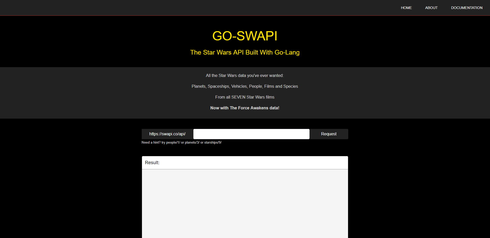
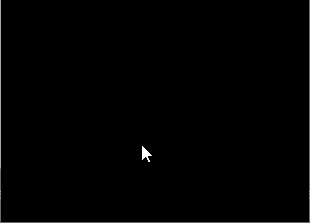

# client

client's code of go-swapi。

go-swapi项目的前端部分，vue-cli + axios + RESTFUL + elementUI。架构如下：

## 分析

[原版网站](https://swapi.co/)

因为重点是RESTFUL的请求，主页面只有一个输入框，把所有数据发送给go的服务器即可，返回数据显示在下方文本框中即可。

### 基本功能

vue-cli提供了搭建好的webpack打包服务和测试服务器，我在编码时只需要npm run serve就可以在本地看到网页内容，同时提供了热加载功能，非常方便。

之前使用vue我还在使用jQuery，这次项目发现vue的数据绑定不需要再直接或简介访问DOM了，完全改成用数据驱动实现。

### ~~axios~~JsonP

axios完全简化了ajax或原生操作，采用promise，配合箭头函数很好用。但是这里我们为了解决跨域请求的问题，采用了JsonP的方法进行数据请求。

JsonP利用了html中的script标签不要求同源的原理解决跨域请求问题，实现方法就是在请求时新建script标签，其中的src引用填写请求的数据字段加上callback函数名，callback函数是已经存在的，这样在请求成功后就能调用calllback函数接收数据了。

### UI

ElementUI我只用了一点点，感觉目前和bootstrap相比很类似，都是给控件提供基本样式，减少编码。

UI设计完全模仿了原网站，但我觉得黑色主色调比原网站的深蓝色更适合Star Wars，我找了系列电影的海报，发现黑色，黄色和光剑的红蓝绿是主色，所以我的主要颜色用了这几个，结构模仿原网站：

另外，为了好玩，我实现了鼠标点击的闪出光剑效果，一共四种颜色，连续点击就有似乎光剑碰撞的效果：

## 测试

配合swagger的api文档以及mock server，规范api使用，swagger提供根据文档生成服务器的方法，我生成了nodejs服务器，完成api与前端测试。

## 部署到Docker镜像

首先按照文档在主目录下新建并编写Dockerfile，规定使用环境为node，运行时执行npm install安装依赖等。

然后用`sudo docker build -t goswapifront .`命令构建镜像，构建成功后可以在docker的镜像列表中看到该镜像，最后用`docker run -d -p 8081:8081 goswapifront`在后台运行镜像，并把主机的8081端口映射到容器的8081端口，这样就成功启动了镜像。
